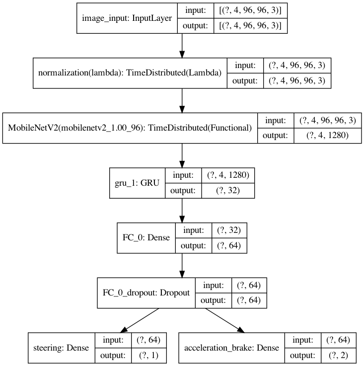
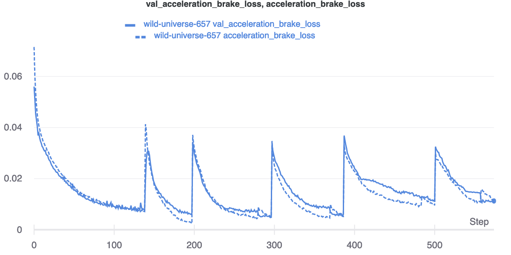
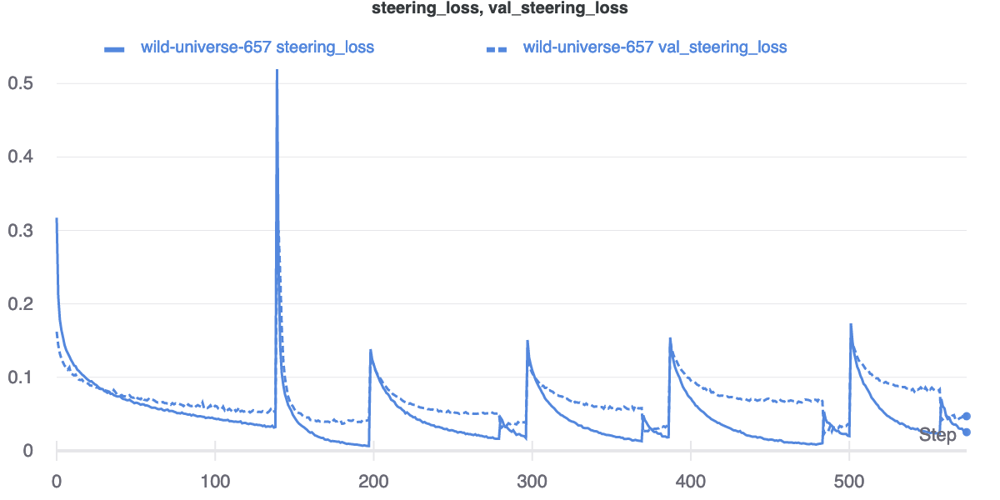

# CarRacing

## Theory
In this project is used a big powerful pre-trained model to pre-process image data from the game - Car Racing. After that, the decision network predicts the steering, accelerator and brake. The decision network part consist of recurrent (GRU) and Fully-connected layers. Between layers is used dropout layer to prevent over-fitting.

The model is trained on many datasets. In this repo are created & prepared datasets from many episodes of the game. Every dataset contains about 10 episodes. The dividing data into smaller datasets is useful if we are training the model on video sequence that's more memory consuming. Every dataset can be safety transformed into video sequences with us defined length (timesteps). In this project is used as default **4 frames** in one video sequence. Every frame uses all channels (RGB) and its size is 96x96 pixels. Before processing the images by a neural network, they must be normalized from range **[0, 255]** to range **[-1, 1]** (**lambda layer**). The outputs from the model are normalized too by their own activation functions [**tanh()**, **sigmoid()**].

> In the future, this project will be the basis for working on robot interacting with the real world. This simulation helps pre-train model on the track, then robot drives according to it. The big power is stored in deep vision model for processing images from the environment.

#### Links

* [Transfer learning with a pretrained ConvNet](https://www.tensorflow.org/tutorials/images/transfer_learning)
* [Transfer Learning (C3W2L07) -> YouTube](https://www.youtube.com/watch?v=yofjFQddwHE)
* [An Algorithmic Perspective on Imitation Learning](https://arxiv.org/pdf/1811.06711.pdf)
* [Training a neural network with an image sequence](https://medium.com/smileinnovation/training-neural-network-with-image-sequence-an-example-with-video-as-input-c3407f7a0b0f)

## State space

State | Shape
------------ | -------------
Game window | 4x96x96x3 (**4 timesteps** (frames), **RGB**)

## Action space

Action | Range | Activation function
------------ | ------------- | -------------
Steering | (-1, 1) | tanh()
Accelerator | (0, 1) | sigmoid()
Brake | (0, 1) | sigmoid()

## Task List

- [x] **Human expert’s demonstrations** + **Transfer** learning
- [x] Using the **recurrent layer** before the output layer.
- [ ] Deploy the trained model to practical testing on the real robot.

## Model

## Charts

## License

